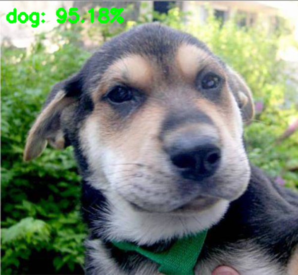
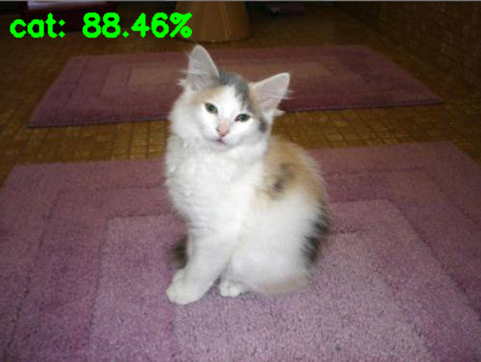

# A Simple Neural Network with Python and Keras

A simple feedforward neural network implementation on <a href="https://www.kaggle.com/c/dogs-vs-cats/data"> Kaggle Dogs vs Cats classification challenge.</a>

# Feedforward neural networks
While there are many, many different neural network architectures, the most common architecture is the feedforward network. In this type of architecture, a connection between two nodes is only permitted from nodes in layer i to nodes in layer i + 1 (hence the term feedforward; there are no backwards or inter-layer connections allowed).
Furthermore, the nodes in layer i are fully connected to the nodes in layer i + 1. This implies that every node in layer i connects to every node in layer i + 1.

# Output

<table>
  <tr>
     <td> <h3>DOG</h3> </td>
     <td> <h3>CAT</h3> </td>
  </tr>
  <tr>
    <td> </td>
    <td></td>
   </tr> 
</table>
