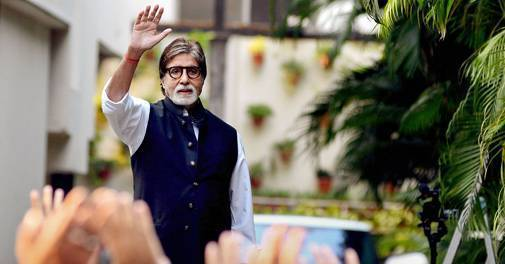
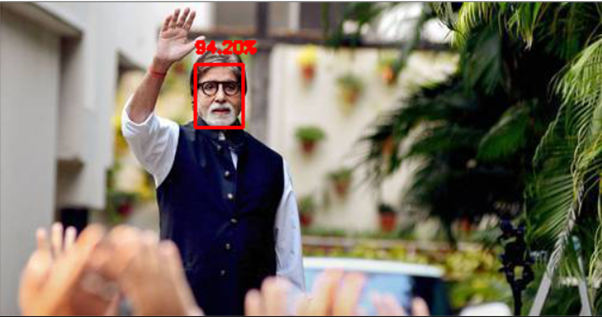

# Face Detection with OpenCV and Deep Learning

OpenCV 3.3 officially released with the most popular "Deep Neural Network" (dnn) module.

This module includes a more accurate, deep learning-based face detector.

In order to use OpenCV’s deep neural network module with Caffe models,two sets of files are required:

* The ***.prototxt*** file(s) which define the model architecture (i.e., the layers themselves)
* The ***.caffemodel*** file which contains the weights for the actual layers

OpenCV’s deep learning face detector is based on the **Single Shot Detector (SSD)** framework with a **ResNet base network**

# OpenCV commands used:

1) ***cv2.dnn.readNetFromCaffe*** - Read the caffe protxt file and model file
2) ***cv2.dnn.blobFromImage(image, scalefactor=1.0, size, mean, swapRB=True)*** -Takes care of pre-processing which includes setting the blob dimensions and normalization.
 Parameters Used:
    1) `image` : This is the input image we want to preprocess before passing it through our deep neural network for classification.
    2) `scalefactor` : After we perform mean subtraction we can optionally scale our images by some factor. This value defaults to `1.0 (i.e., no scaling)` but we can supply another value as well. It’s also important to note that scalefactor should be 1 / σ as we’re actually multiplying the input channels (after mean subtraction) by scalefactor .
    3) `size` : Here we supply the spatial size that the Convolutional Neural Network expects. For most current state-of-the-art neural networks this is either 224×224, 227×227, or 299×299.
    4) `mean` : These are our mean subtraction values. They can be a 3-tuple of the RGB means or they can be a single value in which case the supplied value is subtracted from every channel of the image. If you’re performing mean subtraction, ensure you supply the 3-tuple in `(R, G, B)` order, especially when utilizing the default behavior of swapRB=True .
    5) `swapRB` : OpenCV assumes images are in BGR channel order; however, the mean value assumes we are using RGB order. To resolve this discrepancy we can swap the R and B channels in image by setting this value to `True`. By default OpenCV performs this channel swapping for us.
    
# Execution Command
* detect_faces.py : Used to detect faces in images

  Command: python detect_faces.py --image singleface.jpg --prototxt deploy.prototxt.txt --model res10_300x300_ssd_iter_140000.caffemodel
  
* detect_faces_video.py: Used to detect faces in video

  Command: python detect_faces_video.py --prototxt deploy.prototxt.txt --model res10_300x300_ssd_iter_140000.caffemodel

# Output

Before Execution:

After Execution:

