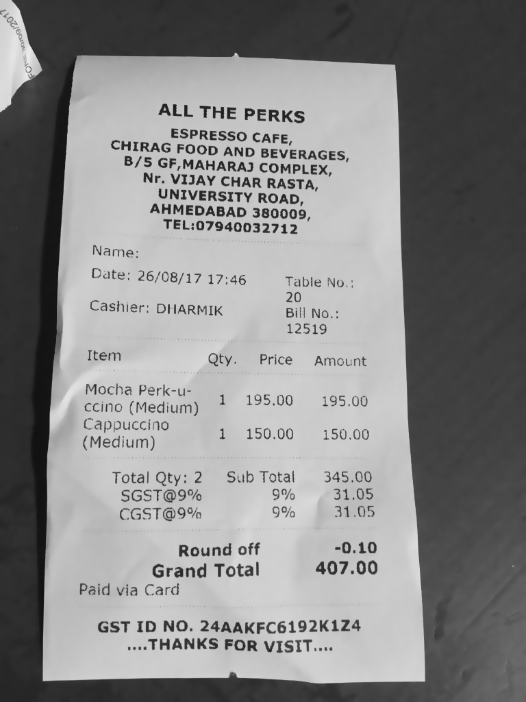
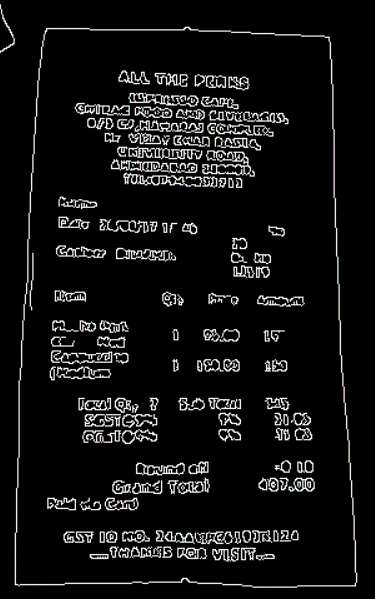
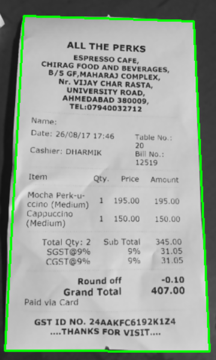
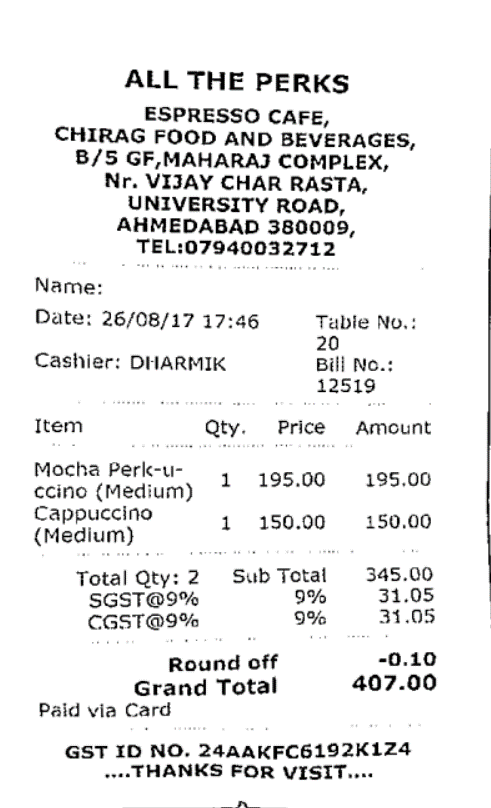

# Document Scanner with OpenCV

# 3 Key Steps:
1) Detect edges.
2) Use the edges in the image to find the contour (outline) representing the piece of paper being scanned.
3) Apply a perspective transform to obtain the top-down view of the document.

# OpenCV commands used:
1) Edge Detection:
   1) ***cv2.cvtColor*** - Converting image from BGR to Grayscale or vice versa
   2) ***cv2.GaussianBlur*** - Blur an image to reduce high-frequency noise, making it easier for our algorithms to detect and understand the actual contents of the image rather than just noise that will “confuse” our algorithms.
   3) ***cv2.Canny*** - Edge detection is useful for finding boundaries of objects in an image — It is effective for segmentation purposes.

2) Finding Contours:
   1) ***cv2.findContours*** - To detect the contours(i.e., outlines) of the foreground objects in the image.
   2) ***imutils.grab_contours*** - Grab the contours
   3) ***cv2.contourArea*** - Gives the area of contours.
   4) ***cv2.arcLength*** - Calculate the perimeter of the contour.
   5) ***cv2.approxPolyDP*** - The process of approximating the shape of a contour of a given polygon to the shape of the original polygon to the specified precision.
   6) ***cv2.drawContours*** - Draw the approximated contours.

3) Apply a Perspective Transform & Threshold:
   1) ***cv2.getPerspectiveTransform*** - A perspective transform is used to obtain a top-down, “birds eye view” of an image — provided that we could find reference points.
   2) ***cv2.warpPerspective*** - Warped or Top-Down view of the image.

# Execution Command:
python scan.py --image images/firstreceipt.png

# Output
1) Edge Detection:
<table>
  <tr>
     <td> <h3>ORIGINAL IMAGE</h3> </td>
     <td> <h3>EDGED IMAGE</h3> </td>
  </tr>
  <tr>
    <td> </td>
    <td></td>
   </tr> 
</table>

2) Finding Contours:
<table>
  <tr>
     <td> <h3>ORIGINAL IMAGE</h3> </td>
     <td> <h3>CONTOUR IMAGE</h3> </td>
  </tr>
  <tr>
    <td> </td>
    <td></td>
   </tr> 
</table>

3) Perspective Transformation and Final Warped Image
<table>
  <tr>
     <td> <h3>ORIGINAL IMAGE</h3> </td>
     <td> <h3>SCANNED IMAGE</h3> </td>
  </tr>
  <tr>
    <td> </td>
    <td></td>
   </tr> 
</table>
