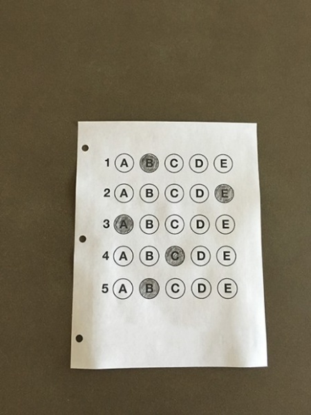
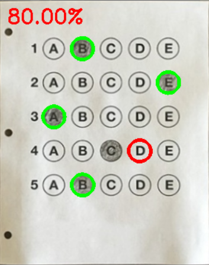

# Bubble sheet multiple choice scanner and Test grader using using OMR, Python, and OpenCV

Optical Mark Recognition, or OMR for short, is the process of automatically analyzing human-marked documents and interpreting their results.

# 7 Key Steps:
1) Detect the exam in an image.
2) Apply a perspective transform to extract the top-down, birds-eye-view of the exam.
3) Extract the set of bubbles (i.e., the possible answer choices) from the perspective transformed exam.
4) Sort the questions/bubbles into rows.
5) Determine the marked (i.e., “bubbled in”) answer for each row.
6) Lookup the correct answer in our answer key to determine if the user was correct in their choice.
7) Repeat for all questions in the exam.

# OpenCV commands used:
1) ***cv2.cvtColor*** - Converting image from BGR to Grayscale or vice versa
2) ***cv2.GaussianBlur*** - Blur an image to reduce high-frequency noise, making it easier for our algorithms to detect and understand the actual contents of the image rather than just noise that will “confuse” our algorithms.
3) ***cv2.Canny*** - Edge detection is useful for finding boundaries of objects in an image — It is effective for segmentation purposes.
4) ***cv2.findContours*** - To detect the contours(i.e., outlines) of the foreground objects in the image.
5) ***imutils.grab_contours*** - Grab the contours.
6) ***cv2.contourArea*** - Gives the area of contours.
7) ***cv2.arcLength*** - Calculate the perimeter of the contour.
8) ***cv2.approxPolyDP*** - The process of approximating the shape of a contour of a given polygon to the shape of the original polygon to the specified precision.
9) ***cv2.threshold*** - Thresholding can help us to remove lighter or darker regions and contours of images or binarization/segmenting the foreground from the background of the image.
10) ***contours.sort_contours*** - Sorting contours with specified method.
11) ***cv2.bitwise_and*** - Masks allow us to “mask out” regions of an image we are uninterested in.
12) ***cv2.countNonZero*** - Count the number of non-zero pixels in the masked region.

# Execution Command:
python test_grader.py --image marksheet.jpg

# Output

<table>
  <tr>
     <td> <h3>ORIGINAL IMAGE</h3> </td>
     <td> <h3>CHECKED IMAGE</h3> </td>
  </tr>
  <tr>
    <td> </td>
    <td></td>
   </tr> 
</table>
