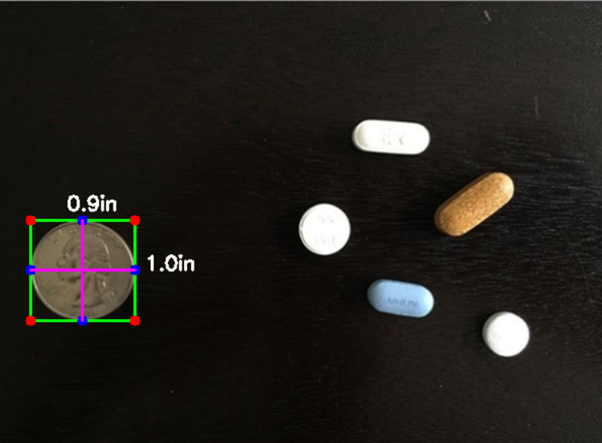
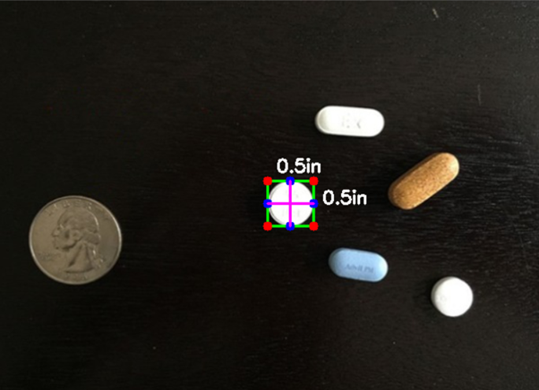

# Measuring size of objects in an image with OpenCV

Measuring the size of objects in an image is similar to computing the distance from our camera to an object — in both cases, we need to define a ratio that measures the number of pixels per a given metric.

In order to determine the size of an object in an image, we first need to perform a “calibration” using a reference object. Reference object should have two important properties:
1) We should know the dimensions of this object (in terms of width or height) in a measurable unit (such as millimeters, inches, etc.).
2) We should be able to easily find this reference object in an image, either based on the placement of the object (such as the reference object always being placed in the top-left corner of an image) or via appearances (like being a distinctive color or shape, unique and different from all other objects in the image). In either case, our reference should should be uniquely identifiable in some manner.

# OpenCV commands used:
1) ***cv2.cvtColor*** - Converting image from BGR to Grayscale or vice versa
2) ***cv2.GaussianBlur*** - Blur an image to reduce high-frequency noise, making it easier for our algorithms to detect and understand the actual contents of the image rather than just noise that will “confuse” our algorithms.
3) ***cv2.Canny*** - Edge detection is useful for finding boundaries of objects in an image — It is effective for segmentation purposes.
4) ***cv2.erode*** and ***cv2.dilate*** - Erosions and dilations are typically used to reduce noise in binary images (a side effect of thresholding).
5) ***cv2.findContours*** - To detect the contours(i.e., outlines) of the foreground objects in the image.
6) ***imutils.grab_contours*** - Grab to obtained contours.
7) ***cv2.contourArea*** - Identify the area of contour.
8) ***cv2.cv.BoxPoints*** or ***cv2.boxPoints*** - Compute the rotated bounding box of the image.

# Output
<table>
  <tr>
     <td> <h3>REFERENCE OBJECT IMAGE</h3> </td>
     <td> <h3>MEASURED OBJECT IMAGE</h3> </td>
  </tr>
  <tr>
    <td> </td>
    <td></td>
   </tr> 
</table>
