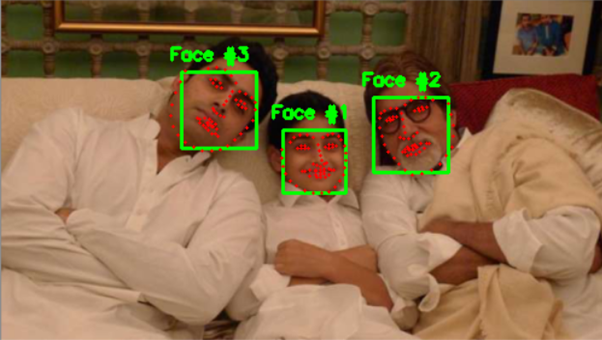

# Facial landmarks with dlib, OpenCV, and Python

Facial landmarks are used to localize and represent salient regions of the face, such as:
* Mouth
* Right eyebrow
* Left eyebrow
* Right eye
* Left eye
* Nose
* Jaw

Facial landmarks have been successfully applied to face alignment, head pose estimation, face swapping, blink detection and much more.

The pre-trained facial landmark detector inside the dlib library is used to estimate the location of 68 (x, y)-coordinates that map to facial structures on the face.

NOTE: The dlib shape detector file "shape_predictor_68_face_landmarks.dat" is not uploaded in this directory since it is too big. Please download this file and position in the same folder for execution of this project.

# 2 Key Steps:
1) Localize the face in the image.
2) Detect the key facial structures on the face ROI.

# OpenCV commands used:
1) ***cv2.cvtColor*** - Converting image from BGR to Grayscale or vice versa
2) ***cv2.rectangle*** - Drawing a rectangle on an image
3) ***cv2.circle*** - Drawing a circle on an image

# Execution Command:
python facial_landmarks.py --shape-predictor shape_predictor_68_face_landmarks.dat --image multiplefaces.jpg

# Output
<table>
  <tr>
     <td> <h3>ORIGINAL IMAGE</h3> </td>
     <td> <h3>FACIAL LANDMARK IMAGE</h3> </td>
  </tr>
  <tr>
    <td> </td>
    <td></td>
   </tr> 
</table>
